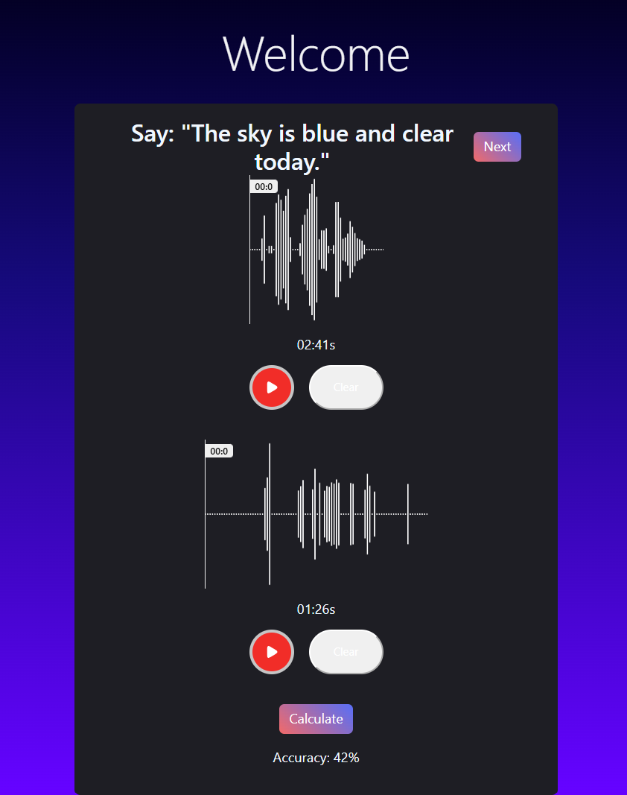
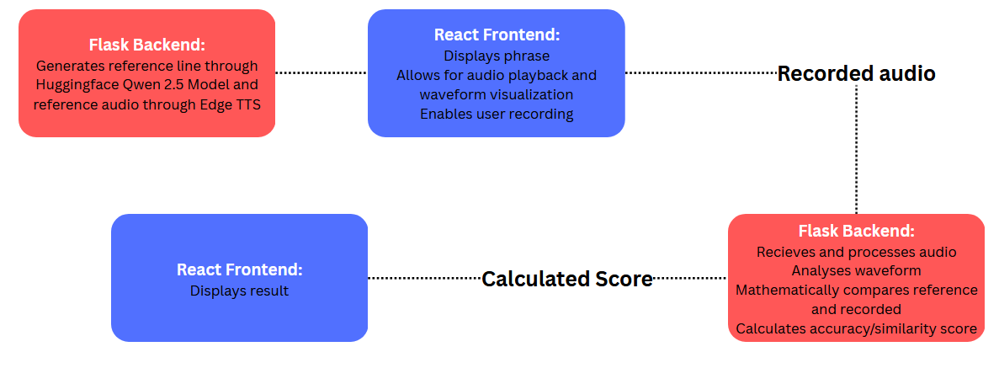

# Profora

> A full-stack pronunciation practice application that combines generative AI, text-to-speech, browser-based voice recording, and audio analysis to provide users with pronunciation accuracy feedback.

  

## Overview

Profora is a full-stack voice pronunciation application designed to make speaking practice more interactive and measurable.

Users are given a phrase to pronounce along with a reference recording. They can then record their own pronunciation directly in the browser. The recorded audio is sent to a Flask backend, where it is processed and compared against the reference audio using **cosine similarity** to produce an accuracy/similarity score.

Both the reference audio and the user-recorded audio can be viewed and scrubbed through.

The project combines a **React + TypeScript frontend** with a **Python + Flask backend**, while using **Qwen 2.5**, **Hugging Face**, and **Edge TTS** to generate and provide reference pronunciation material.

---

## Features

- **Browser-based voice recording**
  - Record pronunciation directly through the web application.

- **Reference pronunciation**
  - Listen to an example pronunciation before practicing.

- **Real-time waveform visualization**
  - Visualize both the reference and recorded audio.

- **AI-generated practice phrases**
  - Generate pronunciation practice material using Qwen 2.5 through Hugging Face.

- **Text-to-speech reference audio**
  - Converts generated phrases into spoken reference audio using Edge TTS.

- **Automated pronunciation scoring**
  - Compare recorded and reference audio using cosine similarity to generate an accuracy/similarity score.

- **Repeatable practice workflow**
  - Generate new phrases and continue practicing.

---

## Architecture

Profora uses a React frontend and Flask backend connected through an audio-processing pipeline.

  

## Tech Stack

### Frontend

- **React 19**
- **TypeScript**
- **Vite**
- **Axios**
- **React Voice Visualizer**
- **Browser MediaRecorder / audio APIs**

### Backend

- **Python**
- **Flask**

### AI & Speech

- **Qwen 2.5**
- **Hugging Face**
- **Microsoft Edge TTS**

### Development

- **Git / GitHub**
- **REST API communication**
- **Audio processing**

## Future Improvements
 - More detailed feedback
 - Individual pronunciation errors
 - User accounts and practice history
 - Deploying app for public use
